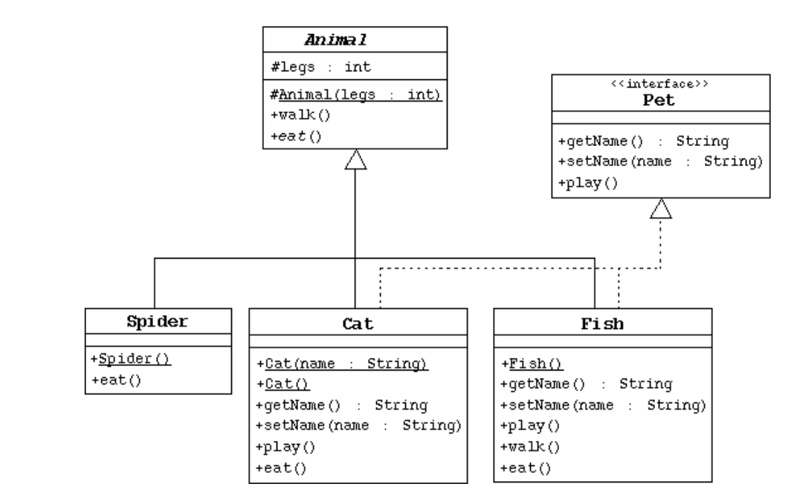

# Laboratory Exercises #6

[All Exercises](../README.md)

[<< Laboratory Exercise 05](../Lab_05/readMeLab05.md) | [Laboratory Exercise 07 >>](../Lab_07/readMeLab07.md)

## Objective

- Demonstrating the concepts of abstract classes, interfaces and polymorphism.
## Preparation Tasks
- Understanding/Revising the object oriented concepts that are covered in the previous laboratory sessions.

## Activities

#### a. Based on the following UML diagram and instructions given at the bottom develop a simple Java program.



- Create the **Animal** class, which is the abstract superclass of all animals.

Declare a protected integer attribute called **legs**, which records the number of legs for this animal.

Define a protected constructor that initializes legs attribute.

Declare an abstract method **eat**.

Declare a concrete method **walk** that prints out something about how the animals walks. This methods shall include *legs* attribute while describing animals walking mechanism.

[Solution file to Animal](./LAB06A/Animal.java)
> Solution Code
```Java
public abstract class Animal 
{
    protected int leg;
    
    protected Animal(int legValue)
    {
        leg = legValue; // minimum leg an animal can have
    }

    public abstract void eat();

    public void walk ()
    {
        System.out.println("The animal walks with " + leg + "legs.");
    }
}
```
-  Create the Spider class.
  
The Spider class extends the Animal class.

Define a default constructor that calls the superclass constructor to specify that all spiders have eight legs.

Implement the eat method.

[Solution file to Spider](./LAB06A/Spider.java)
> Solution Code
```Java
public class Spider extends Animal
{
    public Spider()
    {
        super(8);
    }

    @Override
    public void eat()
    {
        System.out.println("I am eating a mosquito.");
    }
}
```

- Create the Pet interface as per the UML diagram shown above.
  

[Solution file to Pet](./LAB06A/Pet.java)
> Solution Code
```Java
public interface Pet 
{
    String getName();

    void setName(String thePetName);

    void play();   
}
```

- Create the Cat class that extends Animal and implements Pet.

This class must include a String attribute to store the name of the pet.

Define a constructor that takes one String parameter that specifies the cat’s name. This constructor must also call the superclass constructor to specify that all cats have four legs.

Define another constructor that takes no parameters. Have this constructor call the previous constructor (using this keyword) and pass an empty string as the argument.

Implement the Pet interface methods.

Implement the eat method.

[Solution file to Cat](./LAB06A/Cat.java)
> Solution Code
```Java
public class Cat extends Animal implements Pet
{
    private String catName;
    
    public Cat()
    {
        super(4);
    }

    public Cat(String catName)
    {
        // No need to recieve the number of legs
        super(4);
        this.setName(catName);
    }

    public void setName(String theName)
    {
        catName = theName;
    }

    public String getName()
    {
        return catName;
    }

    public void play()
    {
        System.out.println("The cat is playing with it's ball.");
    }

    public void eat()
    {
        System.out.println("The cat is eating sushi");
    }   
}
```

- Create the Fish class. Override the Animal methods to specify that fish can’t walk and don’t have legs.

[Solution file to Fish](./LAB06A/Fish.java)
> Solution Code
```Java
public class Fish extends Animal implements Pet
{
    String fishName;

    public Fish()
    {
        super(0);
    }

    public void setName(String fishName)
    {
        this.fishName = fishName;
    }
    
    public String getName()
    {
        return fishName;
    }

    @Override
    public void walk()
    {
        System.out.println("A fish don't have legs it's swimming.");
    }

    @Override
    public void play()
    {
        System.out.println("The fish is playing with water.");
    }

    @Override
    public void eat()
    {
        System.out.println("The fish is eating another fish.");
    }   
}
```

- Create a class named AnimalClassTest, add a main method and manipulate instances of the classes that are created before by starting with:

```
Fish d = new Fish();
Cat c = new Cat(“Fluffy”);
Animal a = new Fish();
Animal e = new ();
Pet p = new Cat();
```

- After instantiating the above classes in the main method, you shall experiment:
By calling the methods in each object
By casting objects.

[Solution file to AnimalClassTest](./LAB06A/AnimalClassTest.java)
> Solution Code
```Java
public class AnimalClassTest 
{
    public static void main(String args[])
    {
        Fish nimo = new Fish();
        Cat garfield = new Cat("Garfield");
        Animal a = new Fish();
        Spider spidy = new Spider();
        Pet p = new Cat();
        //Animal e = new();

        // Implementing fish methods
        nimo.setName("Nimo");
        System.out.println("The name of our pet fish is: " +nimo.getName());
        nimo.setName("Dory");
        System.out.println("Now the name of our pet fish is: " +nimo.getName());
        nimo.play();
        nimo.walk();
        nimo.eat();

        System.out.println();

        // Implementing cat methods
        System.out.println("The name of the cat is "+ garfield.getName());
        garfield.setName("Puss");
        garfield.play();
        garfield.eat();

        System.out.println();

        //Implementing spider methods
        spidy.eat();

        System.out.println();
        //Implementing animal methods
        a.eat();
        a.walk();
        //Using casting to implement fish's methods with it's super class
        ((Fish)a).setName("Nimo's Father");
        System.out.println("The name of the animal is "+((Fish)a).getName());
        
        //Can't call subclass's methods

        System.out.println();
        //Implementing cat's methods

        //Implementing interface methods with it's implementations
        p.play();
        System.out.println("The name of the pet is "+ p.getName());
        p.setName("Tom");
        System.out.println("The name of the pet now is "+ p.getName());
    }
}
```
---

<center>

### Feel free to report any typos or bugs on [dododoyo](https://github.com/dododoyo)

</img>

## Made With 🖤 By  [🐬](https://github.com/dododoyo)

</center>

---