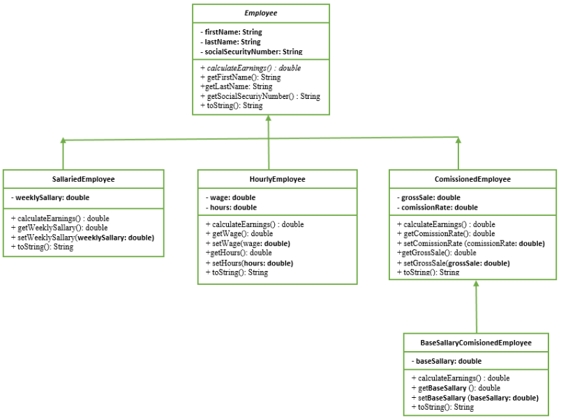

# Laboratory Exercises #7

[All Exercises](../README.md)

[<< Laboratory Exercise 06](../Lab_06/readMeLab06.md) | [Laboratory Exercise 08 >>](../Lab_08/readMeLab08.md)

## Objective
- Understanding the Concept of polymorphism using class hierarchy.
- Understanding the basics of UML class diagrams which ease the object oriented analysis and design tasks.

## Preparation Tasks
- Understanding/Revising the object oriented concepts that are covered in the previous laboratory sessions.

## Activities

#### a. Using the following UML class diagram and the companion instructions given below, develop a fully functional Java program that demonstrate runtime polymorphism
- Create an abstract class named Employee which is a parent class.



- The class shall comprise three private fields of String: firstName, lastName, socialSecurityNumber and a total of five public methods: one abstract method named calculateEarnings that take no parameters and returns double, other three public methods that take no parameter and returns the three private fields of the class. And one method named toString which takes no parameter and returns string. This method is intended to override the method named toString() which is found in Java.lang.object class.
  

[Solution file to Employee](./LAB07A/Employee.java)
> Solution Code
```Java
public abstract class Employee 
{
    private String firstName;
    private String lastName;
    private String socialSecurityNumber;

    public abstract double calculateEarnings();

    public String getFirstName(){return firstName;}

    public String getLastName(){return lastName;}

    public String getSocSecNumber(){return socialSecurityNumber;}

    @Override
    public String toString()
    {
        return "The name of the employee is "+ firstName + " "+lastName
                                +"\n"+"with social security number "+socialSecurityNumber;

    }
}
```

- Create a class SalariedEmployee which is a sub class of employee and has one private attribute of double data type named weeklySalary. The class shall also comprise public methods for initializing and accessing its private field. The class shall also comprise two methods that override the parent class methods named toString and calculateEarnings methods.

[Solution file to SalariedEmployee](./LAB07A/SalariedEmployee.java)
> Solution Code
```Java
public class SalariedEmployee extends Employee
{
    private double weeklySalary;

    public void setWeeklySalary(double theSalary)
    {
        weeklySalary = theSalary;
    }

    public double getWeeklySalary()
    {
        return weeklySalary;
    }

    public double calculateEarnings()
    {
        // since there are approximately 4 weeks in a month
        return 4*this.getWeeklySalary();
    }

    public String toString()
    {
        return super.toString()+"\n"
                + "with a monthly salary of "+ this.calculateEarnings();
    }   
}
```

- Create a class HourlyEmployee which is a sub class of employee and has two private attributes of double data type named wage and hours. The class shall also comprise public methods for initializing and accessing its private fields. The class shall also comprise two methods that override the parent class methods named toString and calculateEarnings methods.

[Solution file to HourlyEmployee](./LAB07A/HourlyEmployee.java)
> Solution Code
```Java
public class HourlyEmployee extends Employee
{
    private double wage;
    private double hours;

    public void setWage(double theWage){wage = theWage;}

    public void setHour(double theHours){hours = theHours;}

    public double getWage(){return wage;}

    public double gethours(){return hours;}

    public double calculateEarnings()
    {
        if(hours <= 40)
        return wage*hours;

        else
        return wage*(40) +((hours-40)*1.5);

    }
    public String toString()
    {
        return super.toString()+"\n"
        +"With a salary of "+this.calculateEarnings();
    }    
}
```

- Create a class CommissionedEmployee which is a sub class of employee and has two private attributes of double data type named grossSale and commissionRate. The class shall also comprise public methods for
initializing and accessing of its private fields. The class shall also comprise two methods that override the parent class methods named toString and calculateEarnings methods.

[Solution file to CommissionedEmployee](./LAB07A/CommisionedEmployee.java)
> Solution Code
```Java
public class CommisionedEmployee extends Employee
{
    private double grossSale;
    private double commissionRate;

    public void setGrossSale(double theSale){grossSale = theSale;}

    public void setComissionRate(double theRate){commissionRate = theRate;}

    public double getGrossSale(){return grossSale;}

    public double getComissionRate(){return commissionRate;}

    public double calculateEarnings()
    {
        return grossSale*commissionRate;
    }
    public String toString()
    {
        return super.toString()+"\n"
        +"With a salary of "+this.calculateEarnings();
    }     
}
```

- Create a class BaseSallariedCommisionedEmployee which is a sub class of CommissionedEmployee and has one private attributes of double data type named baseSallary. The class shall also comprise public methods for initializing and accessing of its private fields. The class shall also comprise two methods that override the parent class methods named toString and calculateEarnings methods.

[Solution file to BaseSallariedCommisionedEmployee](./LAB07A/BaseSallariedCommisionedEmployee.java)
> Solution Code
```Java
public class BaseSallariedCommisionedEmployee extends CommisionedEmployee
{
    private double baseSallary;
    
    public double getBaseSalary(){return baseSallary;}

    public void setBaseSalary(double theSallary){ baseSallary = theSallary;}

    public double calculateEarnings()
    {
        return super.calculateEarnings() + baseSallary;
    }
    public String toString()
    {
        return super.toString()+"\n"
        +"With a salary of "+this.calculateEarnings();
    } 
}
```

- Other implementation details:

> For salaried employees, their income is fixed income which is paid in a weekly basis.
> For hourly employees, their income is calculated just by multiplying the number of hours worked by the hourly salary rate for the first 40 hours but the work which is done outside the 40 hour time frame will be considered as overtime and calculated by multiplying the number of hours worked by the hourly salary rate by 1.5.
>
> For commissioned employees, their income is calculated by multiplying the gross salary by commission rate. For base salaried commissioned employees their income is calculated by multiplying the gross sale by commission rate and adding the base salary.
>
> The method toString() is used to return a the employee information including first name, last name,
social security number and weekly earnings.

- Finally create a class named EmployeeTest and implement following code and report what you under-
stand to your respective laboratory session instructor.

[Solution file to EmployeeTest](./LAB07A/EmployeeTest.java)
> Solution Code
```Java
public class EmployeeTest
{
    public static void empDescription(Employee e) 
    {
        System.out.println(e.toString());
    }
    public static void main(String args[ ])
    {
        SalariedEmployee se=new SalariedEmployee();
        se.setWeeklySalary(9000);

        HourlyEmployee he=new HourlyEmployee();
        he.setHour(89);
        he.setWage(1000);

        CommissionedEmployee ce = new CommissionedEmployee();
        ce.setCommissionRate(0.19);
        ce.setGrossSale(20000);

        BaseSallariedCommisionedEmployee bsce = new BaseSallariedCommisionedEmployee();
        bsce.setBaseSalary(9000);
        bsce.setCommissionRate(0.20);
        bsce.setGrossSale(100000);

        Employee e[]=new Employee[4];
        e[0]=se;
        e[1]=he;
        e[2]=ce;
        e[3]=bsce;

        for(Employee myEmp:e)
        {
            if(myEmp instanceof BaseSallariedCommisionedEmployee)
            {
                BaseSallariedCommisionedEmployee emp = (BaseSallariedCommisionedEmployee)myEmp;
                emp.setBaseSalary(4000);
                emp.setCommissionRate(0.15);
                emp.setGrossSale(10000); 
                System.out.println(myEmp);
            }
            else if(myEmp instanceof CommissionedEmployee)
            {
                CommissionedEmployee emp = (CommissionedEmployee)myEmp;
                emp.setCommissionRate(0.15);
                emp.setGrossSale(10000);
                System.out.println(myEmp);
            }
            else if(myEmp instanceof HourlyEmployee)
            {
                HourlyEmployee emp = (HourlyEmployee)myEmp;
                emp.setWage(1000); emp.setHour(50);
                System.out.println(myEmp);
            }
            else if(myEmp instanceof SalariedEmployee)
            {
                SalariedEmployee emp = (SalariedEmployee)myEmp;
                emp.setWeeklySalary(5000);
                System.out.println(myEmp);
            }
        } 

        /*
        Calling the empDiscription method with instance of SalariedEmployee class
        */
        System.out.println("\n \n The result of polymorphic method call");
        System.out.println("\n \nCalling the empDiscription method using instance of SalariedEmployee class as an arguement");
        empDescription(se);

        /*
        Calling the empDiscription method with instance of HourlyEmployee class
        */
        System.out.println("\n Calling the empDiscription method using instance of HourlyEmployee class as an arguement");
        empDescription(he);

        /*
        Calling the empDiscription method with instance of CommisionedEmployee class
        */
        System.out.println("\nCalling the empDiscription method using instance of CommisionedEmployee class as an arguement");
        empDescription(ce);

        /*
        Calling the empDiscription method with instance of BaseSallariedCommisionedEmployee class
        */
        System.out.println("\n Calling the empDiscription method using instance of BaseSallariedCommisionedEmployee class as an arguement");
        empDescription(bsce);
    }
}
```
<br>

---

<center>

### Feel free to report any typos or bugs on [dododoyo](https://github.com/dododoyo)

</img>

### Made With 🖤 By  [🐬](https://github.com/dododoyo)

</center>

---